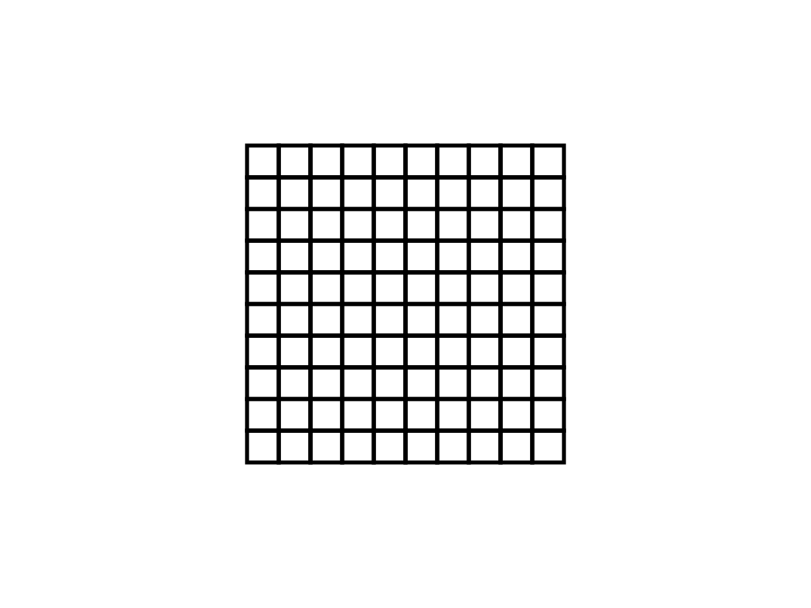
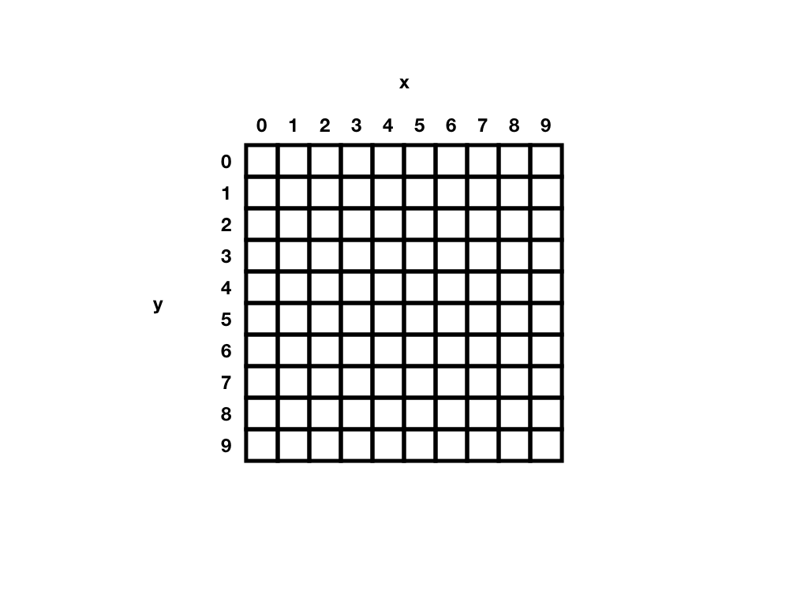

# Drawing shapes {

---

## In this module

- A sandbox project
- Giving instructions
- The canvas
- Points, lines, and shapes
- Shape modes
- Drawing

---

## Start a "sandbox" project to experiment in

While learning to program it's a __very__ good idea to follow along and try things out as you learn them. For that reason, we should start a new JavaScript project to play around in for each week's topic. A "sandbox". This process should be applied every week.

1. __Download and unzip__ the template project again if you need to ()
2. __Rename__ the main folder from `template-p5-project` to something like `drawing-experiments`
3. __Open__ the `drawing-experiments` folder in Atom so you're ready to work on it as a project

__Note__: if you want to, you could move your `drawing-experiments` folder into your `cart253` repository inside a `sandboxes` folder and then commit and push your changes as you work. This way you could keep track of your progress as you try things out. This isn't required for these "sandbox" projects, but could be good practice.

---

## Giving instructions

- It's time to start telling our computers what to do!
- When it comes to programming, that means typing in lines of code
- We call a line of code that tells the computer to do something an __instruction__
- The heart of programming is knowing how to give instructions that a computer will understand
- This can be a challenge because we have to get them __exactly right__
- But when we get them right, we can do magical things

---

## Where to give instructions

- We'll type JavaScript code into our project's `script.js` file
- Select that file now in your `drawing-experiments` project
- By default looks like this:

```javascript
function setup() {

}

function draw() {

}
```

- These two functions called `setup()` and `draw()` are __specific to p5__
- Put simply, the code in `setup()` is run __once__ when your program starts, and `draw()` is run __over and over__, once per frame of animation (usually 60 frames per second)
- We'll get back to all this in more detail later on

---

## Writing instructions in `setup()`

- For now, we're going to write our code __inside the `setup()` function__ so it runs __once__
- By "inside the `setup()` function" we mean __inside the curly brackets after the function__

```javascript
function setup() {
  // WE ARE GOING TO WRITE STUFF IN HERE!!!
}

function draw() {

}
```

- We will come back to the various words and symbols used here
- For now, just remember we're writing instructions (lines of code) inside the curly brackets of `setup()` and this means it will run __once__ when our program starts

---

## The canvas

At the heart of how p5.js works is the __canvas__. The canvas is essentially just the rectangular area your can draw in on the webpage your project runs on. By default the canvas is 100x100 pixels. Quite small.

In order to actually __see__ where the canvas is, let's change the color of its background away from white by changing our `script.js` code in the `drawing-experiments` to the following:

```javascript
function setup() {
  background(200,200,200);
}

function draw() {

}
```

Save the file and run atom-live-server if you haven't already, then check in the browser for the result.

Now we can see the canvas because it has a grey background. You can see that it's 100x100 pixels, and that it's pressed up against the top left corner of the screen.

We'll talk more about the `background()` instruction later.

---

## The pixels

Computer screens are divided up into _pixels_ ("Picture Elements"). If you can zoom your screen, you can even see the individual pixels!

The __canvas__ we draw on in p5.js is a rectangular area that takes up some amount of the webpage our project runs on. By default, we know it's 100x100, but here's a 10x10 example:



So the canvas is basically just a bunch of little squares in a grid.

Amazingly, everything we see on a computer screen involves just setting the colors of the individual pixels
By changing the colors of pixels over time, things appear to move! Stories are told! Nations are lost!

---

## Where on the canvas?

Before we can draw anything confidently, we need to make sure we understand how to say __where__ we want to draw things on a grid like the canvas.

In a graphics application you specify what pixel you want to change the color of by just clicking on it with a pencil or paintbrush. Easy.

But if you're programming you're always just working in __text__ so how would you refer to a specific pixel?

That's right! It's our old friend from maths: __x and y coordinates__!

---

## Life on the canvas

Just like on a graph we have an __x-axis__ and a __y-axis__

- The x-axis starts at the __left__ of the canvas and points from left to right
- The y-axis starts at the __top__ of the canvas and points from top to bottom

Yes, the y-axis is a bit confusing because in math we're draw graphs with the y axis going up rather than down, but it's easy to get used to.

We count the first pixel on an axis from __zero__, so if we're numbering our two axes we have:



---

## There on the canvas!

So, to specify the location of a pixel on the screen (or in our canvas) we give its __x and y coordinates__. x first, then y.

So the pixel at coordindate (5,2) is 6 pixels along to the right from the left edge and 3 pixels down from the __top__ edge. Remember, again, that we're counting from 0.

That's why the little dot in our program is close to the __top__ of the canvas, because the `2` we used for the y-coordinate is close to `0`, which is the top of the canvas.

---

## Shapes

One of the simplest and most satisfying things we can do with p5.js is __draw shapes__ on the canvas. To do so we need to know the special names of the different instructions to do this.

To learn those names, we can look in the p5.js Reference under the [Shape](https://p5js.org/reference/#group-Shape) category. Go have a look now. There are quite a few!

Let's try some out to get the idea.

---

## Getting to the `point()`

Let's use the `point()` function to tell p5 to draw a single pixel in a specific location on the canvas. Here's some code to draw a pixel at (5,2) in a tiny little 100x100 canvas!

```javascript
function setup() {
  background(200,200,200);
  point(5,2);
}
```

If we save and check out the results in our browser, we can see a tiny little dot on the screen, just a single pixel. You might have to move your face closer to the screen to even see it!

So `point(5,2)` is telling our program to draw a single point (a pixel) at the location specified by the numbers `(5,2)`. It clearly works, but what does it all mean?

---

## Nowhere

What would happen if we drew a point at the position (500,500)? Try it out:

```javascript
function setup() {
  background(200,200,200);
  point(500,500);
}
```

Well, we don't see it. Why? Because the position (500,500) is __not on the canvas__, which is only 100x100 pixels in size.

__Deep question__: does this pixel at position (500,500) actually exist? Can we say it's being drawn? Is it in a spooky alternative universe like the Upside Down (from _Stranger Things_?). Is it crying out to be drawn on the canvas so that we will see it and love it? Who knows...

---

## Back to the `point()`

Because it's the very first instruction we're really dealing with, let's go into some detail about that little instruction that says

```javascript
point(5,2);
```

We know that it means "draw a single pixel at position (5,2) on the canvas", and that's the most important thing we need to know, but let's drill a little deeper.

---

## What is the `point()`?

```javascript
point(5,2);
```

- In programming, an instruction like this is called "__calling a function__".
- The function is called `point` and we __call__ it to ask it to draw a point on the canvas
- Let's look at how this function call works in some detail...

---

### `point`

- First we have the _name_ of the function, which is `point`
- In a perfect world the name of the function tells us what it does!
- The name of a function is, like all names in programming, _case sensitive_ and _spelling sensitive_
- Even the tiniest inaccuracy will break everything! Sigh.

---

### `(...)`

- Next we have _parentheses_ (or _brackets_ if you prefer)
- These tell p5 we are giving it the information it needs to carry out the function (called the __arguments__ for the function, which is a weird name)
- In the case of our `point` these parentheses contain the _coordinates_ of the point

__Sad truth:__ Pay attention to making your parentheses _match_! Note that there is an opening and closing parenthesis here and that they go around the information the function needs. There are a _lot_ of parentheses in programming and if you miss one, things break. Sorry!

---

### `5`

- Inside the parentheses we give the function the first piece of information it needs to draw the point, the first _argument_
- In this case it's the number `5`, the _x coordinate_ to draw our point at

---

### `,`

- Because we have _multiple parameters_ (an x position _and_ a y position) we use a _comma_ next
- The arguments of a function are always separated by commas like this

---

## `2`

- Now we give the function the final piece of information it needs to draw the point, the second _argument_
- Which is the _y coordinate_ we want to draw the point at: `2`

---

## `;`

At the end of any __instruction__ we always write a __semicolon__ like this. It basically means "I'm finished telling you what I want you to do for this line!". You could even think about this as saying "please" or something.

It's so, so, _so_ easy to forget semicolons. But please try not to.

__Real Talk:__ JavaScript doesn't __actually__ generally need you to put a semicolon at the end of instructions. Indeed, there is a fairly complex set of rules for when you have to and when it's optional. However, __many other programming languages require a semicolon after an instruction__ so it's much better to build up the habit now

__Real Real Talk:__ Use semicolons at the end of instructions.

---

## `point(5,2);`

So that was quite a lot of excruciating detail, but it's also the same __every time__ we call a function in JavaScript:

- We write the __name__ of the function to call (like `point`)
- We use __parentheses__ around the information the function needs to do its job
- That information is a list of __arguments__ separated by __commas__ (like the x and y coordinates for a point)
- Then we put a __semicolon__ at the end for style

So now we can read something like `point(5,2);` and know that it means...

> __Draw a point at position (10,15) on the canvas!__

We know (some) programming!

---

## `point(x,y)`

When you're looking at the __documentation__ for a function like `point()` you'll most often see the way to use the function like this

```javascript
point(x,y)
```

This is different in one specific way, which is that instead of specific numbers for the x and y coordinates, the documentation will use names for those pieces of information instead, like `x` and `y` here.

The point here is to make it a little easier to know how to use the function, because just by looking at that little description of it you know the name __and__ the nature of the two arguments you would give to it to tell it where to be. You know that the `x` comes first and the `y` comes second, too.

If we look at the __Syntax__ section of the [`point() page`](https://p5js.org/reference/#/p5/point) in the p5.js reference, we see exactly this!

__Aside:__ actually, in the documentation it's written out as

`point(x, y, [z])`

That extra `[z]` at the end is telling you that there is an __optional__ extra argument you could add after the `x` and `y`. As you may already know, when we give __three__ positional coordinates, we're drawing the point is three dimensions, giving it a horizontal (x) and vertical (y) position, but also a __depth__ (z) position.

The square brackets around the `z` are what mean this extra bit is optional, and this is very common in documentation for all programming.

---

## Size matters

Clearly a 100x100 canvas is fine for a default, but we definitely want to be able to change it! It's kind of small, even though you could do some really interesting thing by embracing the restriction.

Fortunately we can specify the size of canvas we want with a function called `createCanvas()` which we use it like this:

```javascript
createCanvas(w,h);
```

Where `w` is the __width__ of the canvas we want, and `h` is the __height__ of the canvas we want.

If we're going to use it, we always call `createCanvas()` at the __start of `setup()`__. Let's try out the following:

```javascript
function setup() {
  // Create a 640x480 canvas
  createCanvas(640,480);
  // Set the background to grey
  background(200,200,200);
  // Draw a point in the middle of the canvas
  point(320,240);
}

function draw() {

}
```

Here we have a small program that

1. Sets the canvas size to 640x480 using the `createCanvas()` function
2. Sets the background color to grey using the `background()` function
3. Draws a point in the centre of the canvas using the `point()` function (with the x and y coordinates of the centre of the canvas as arguments!)

---

## Pick a number, any number

We've now used numbers in a several places to mean different things!

- In `createCanvas(640,480)` the two numbers mean the width and height of the canvas being created
- In `background(200,200,200)` the three numbers mean the color to paint the canvas (in RGB values, which we'll talk about later)
- In `point(320,240)` the two numbers are the x and y coordinates to draw a point at on the canvas

Obviously all these numbers are __meaningful__, but it's also true that we can use __any__ numbers we want to get different results. And we __should__ play around with them to get a feeling for them.

For instance, we could change all the numbers to get something quite different...

```javascript
function setup() {
  createCanvas(500,1);
  background(127,255,127);
  point(100,0);
}

function draw() {

}
```

Now our canvas is very skinny! The background is green! The point is drawn partway along the canvas! (Notice how we used `0` as our y coordinate for the point because the canvas is only one pixel high and the first vertical pixel is numbered `0`.)

__Play around!__

---

## Shapes

Drawing points is pretty great. In fact just by drawing individual points all over the canvas we could draw  anything we wanted! Because __all__ images are just made up of a whole bunch of pixels, right?

However, that would involve a lot of work, and it's better to be able to draw in terms of more complex shapes. Luckily there are other shape functions to draw other shapes with!

Again, you can find a big list on the [Shapes](https://p5js.org/reference/#group-Shape) category of the reference, but let's go through the obvious ones here, too.

---

## `line()`

To draw a line we use the `line()` function and tell it the starting x and y coordinates and the ending x and y coordinates. It will draw a line between them for us. In the documentation it's written as:

```javascript
line(x1,y1,x2,y2);
```

And if we wanted to draw a line across the canvas in a dashing angle, we might write

```javascript
function setup() {
  createCanvas(500,500);
  background(127,255,127);
  line(0,0,500,500);
}

function draw() {

}
```

We can read the [`line()` page](https://p5js.org/reference/#/p5/line) to learn about drawing lines. We should get used to reading the reference to understand each function individually.

---

## `rect()`

If we want to draw a rectangle we use `rect()`, and the default way to supply its information (arguments) is that we specify the x and y coordinates of its top left corner and the width and height it should be. In the documentation, that is:

```javascript
rect(x,y,w,h);
```

And if we were writing code to add a 100x100 rectangle in the middle of our canvas we'd write

```javascript
function setup() {
  createCanvas(500,500);
  background(127,255,127);
  line(0,0,500,500);
  rect(200,200,100,100);
}

function draw() {

}
```

Again, we can read the [`rect() page`](https://p5js.org/reference/#/p5/rect) to learn all about drawing rectangles.

---

## `ellipse()`

To draw an ellipse we use `ellipse()` and we can just __read the documentation__ on the [`ellipse()` page](https://p5js.org/reference/#/p5/ellipse) to know how to use it by specifying the coordinates of the __centre__ of the ellipse along with its width and height.

```javascript
function setup() {
  createCanvas(500,500);
  background(127,255,127);
  line(0,0,500,500);
  rect(200,200,100,100);
  ellipse(250,250,50,50);
}

function draw() {

}
```

---

## Order matters

As we've built up our little abstract drawing, you probably noticed that the __order__ of the shape drawing instructions matters. In particular, it's like layers in Photoshop or other image editing software: the __last shape drawn__ is on top of the previous shapes.

So we need to remember to get the order right depending on what effect we want. Thus, previously we had:

```javascript
function setup() {
  createCanvas(500,500);
  background(127,255,127);
  line(0,0,500,500);
  rect(200,200,100,100);
  ellipse(250,250,50,50);
}

function draw() {

}
```

But if I wanted that `line()` to be on the __top__ of everything, I would draw it last by writing its instruction last in the program:

```javascript
function setup() {
  createCanvas(500,500);
  background(127,255,127);
  rect(200,200,100,100);
  ellipse(250,250,50,50);
  line(0,0,500,500);
}

function draw() {

}
```

Now the line is on top.

---

## And so on!

There are more functions for drawing shapes, such as

- `circle()`
- `arc()`
- `triangle()`
- `quad()`

Each of these has its own documentation page that explains the way to use it to draw it on the canvas.

---

## Drawing modes

There are different ways to think about drawing a shape. Consider a rectangle, which we could draw by

- Giving the coordinates of the top left corner and the width and the height
- Giving the coordinates of the top left corner and the bottom left corner
- Giving the coordinates of the centre and the width and the height

p5.js includes __drawing modes__ that we can use to specify which way we want to draw our rectangles. We use the function called `rectMode()` to do this. Consider the task of drawing a 100x100 square in the centre of our canvas.

`rectMode(CORNER);`  
The _default_ we're used to (top-left corner and width and height).

```javascript
function setup() {
  createCanvas(500,500);
  background(127,255,127);
  rectMode(CORNER);
  rect(200,200,100,100);
}

function draw() {

}
```

`rectMode(CENTER);`  
Instead of the top-left corner the `x` and `y` now specify the _center_ of the rectangle, so we change the x and y to be the centre of the canvas.

```javascript
function setup() {
  createCanvas(500,500);
  background(127,255,127);
  rectMode(CORNER);
  rect(250,250,100,100);
}

function draw() {

}
```

`rectMode(CORNERS);`
Now you write it `rect(x1,y1,x2,y2)` where the first coordinates are the top-left corner and the second coordinates are the bottom-right corner.

```javascript
function setup() {
  createCanvas(500,500);
  background(127,255,127);
  rectMode(CORNERS);
  rect(200,200,300,300);
}

function draw() {

}
```

Notice how for the __specific job of drawing a square in the centre of the canvas__ it is probably easiest to use `rectMode(CENTER)`. This is typical of programming: different tasks often have better ways of approaching them.

---

## Forever after

The `rectMode()` instructions apply to __all__ rectangles drawn after they appear:

```javascript
function setup() {
  createCanvas(500,500);
  background(127,255,127);
  rectMode(CENTER);
  rect(250,250,100,100);
  rect(250,250,90,90);
  rect(250,250,80,80);
}

function draw() {

}
```

All the rectangles are being drawn according to the `rectMode(CENTER)`. If we wanted to use a different mode, we'd have to specify it before drawing the rectangle we wanted to apply it to:

```javascript
function setup() {
  createCanvas(500,500);
  background(127,255,127);

  rectMode(CENTER);
  rect(250,250,100,100);
  rect(250,250,90,90);
  rect(250,250,80,80);
  
  rectMode(CORNER);
  rect(0,0,200,200);
  rect(300,300,200,200);
}

function draw() {

}
```

The last two rectangles are drawn based on their top left corner because `rectMode(CORNER)` was in effect.

---

## `ellipseMode()`

We can do all the same things with the same results to set different ways of drawing an `ellipse()` as well:

`ellipseMode(CENTER);`  
The _default_ we're used to (draw from the center)

`ellipseMode(CORNER);`  
Specify the top-left 'corner' of the ellipse, then the width and height

`ellipseMode(CORNERS);`  
Specify the top-left and bottom-right 'corners' of the ellipse

Likewise, these `ellipseMode()` instructions apply to all ellipses drawn _after_ them

---

## Draw something!

With all these drawing functions, we're now all set up to draw something made out of shapes, like...

```javascript
function setup() {
  createCanvas(500, 500);
  background(127, 255, 127);
  rectMode(CENTER);
  rect(250, 250, 300, 300);
  ellipse(200, 200, 50, 50);
  ellipse(300, 200, 50, 50);
  rect(250, 200, 25, 200);
  arc(250, 300, 200, 100, 0, PI / 2);
}

function draw() {

}
```

And yes, everyone finds the `arc()` function confusing. Well, I do.

---

## Summary

We're now able to see "behind the scenes" of software! We are writing lines of code that make actual stuff happen in a browser, even if it's "just" to draw a smirking robot.

We see the Matrix!

Kind of? Or at least we see a long way deeper into computers and computation than usual. This is __powerful__.

As Spiderman's uncle said, "_With great power comes an excruciating amount of time and effort!_"

---

# }
