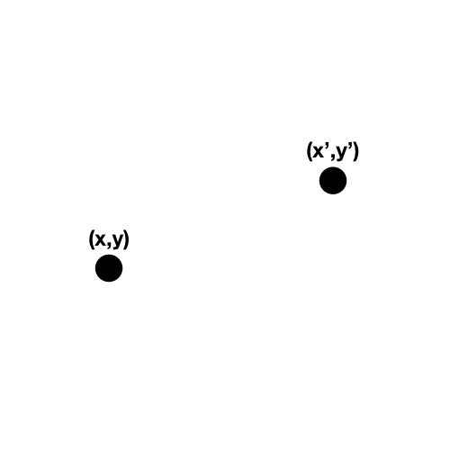
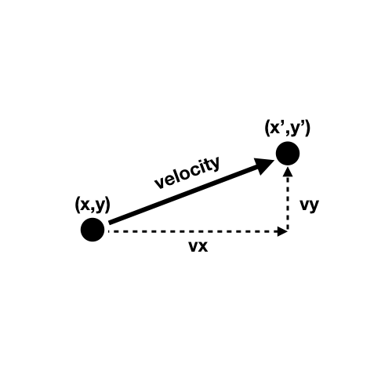
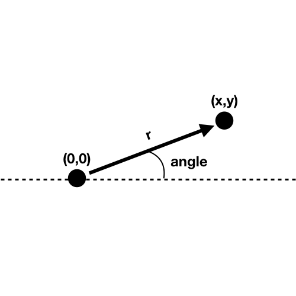
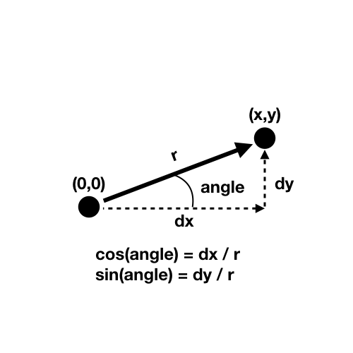
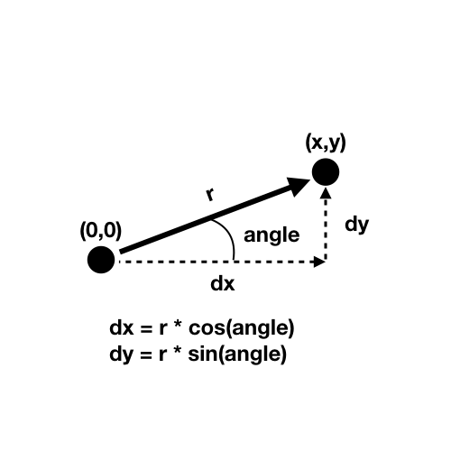
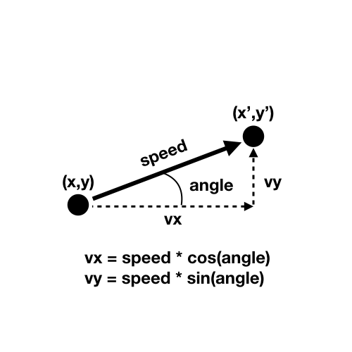

# Movement with polar coordinates {

---

## In this module

- Movement based on x- and y-velocities
- Movement based on direction and speed

- TMI? How the heck do polar coordinates work?
- TMI? Acceleration and drag

---

## Movement based on x- and y-velocities

To this point, we have represented movement in a fairly straightforward way. We have objects with a velocity in the x and y dimensions and we add those velocities to the position of the object to make it move.

Here's a classic example of a user-controlled circle. It moves based purely on its `vx` and `vy` properties. Although it can move in any direction, conceptually it's as if it moves separately on x and y each frame.

```javascript
let circle = {
  x: 300,
  y: 300,
  size: 100,
  vx: 0,
  vy: 0,
  speed: 5
};

function setup() {
  createCanvas(600, 600);
}

function draw() {
  background(0);

  handleInput();
  move();
  wrap();
  display();
}

// handleInput() checks for the arrow keys and sets the velocity
// based on the chosen direction
function handleInput() {
  if (keyIsDown(LEFT_ARROW)) {
    circle.vx = -circle.speed;
  }
  else if (keyIsDown(RIGHT_ARROW)) {
    circle.vx = circle.speed;
  }
  else {
    circle.vx = 0;
  }

  if (keyIsDown(UP_ARROW)) {
    circle.vy = -circle.speed;
  }
  else if (keyIsDown(DOWN_ARROW)) {
    circle.vy = circle.speed;
  }
  else {
    circle.vy = 0;
  }
}

function move() {
  circle.x += circle.vx;
  circle.y += circle.vy;
}

function wrap() {
  if (circle.x > width) {
    circle.x -= width;
  }
  else if (circle.x < 0) {
    circle.x += width;
  }

  if (circle.y > height) {
    circle.y -= height;
  }
  else if (circle.y < 0) {
    circle.y += height;
  }
}

function display() {
  push();
  ellipse(circle.x, circle.y, circle.size);
  pop();
}
```

---

## Movement based on direction and speed

Straightforward x and y velocity is not the only way to think about or program movement in a 2D (or 3D!) space.

Another way would be to think about the **direction** the object is facing and the **speed** it is moving in the direction.

This can feel more "natural" in many ways, because most things **turn** to move in a specific direction, rather than just instantly moving that way.

Using an idea from geometry called **polar coordinates** (explained in the TMI? section if you want to know more), we can represent movement based on the **angle** an object is facing (0 degrees is facing to the right, 90 degrees is facing "up", 180 degrees is facing left, and 270 degrees is facing down) and the **speed** it is moving in that direction.

Using this requires three things

1. An **angle** property in our object to track which way it's facing
2. A **speed** property in our object to track how fast it is currently moving
3. A **formula** for converting from angle and speed to our standard velocities in x and y

Let's do that.

---

## A user-controlled circle with angle and speed

We'll make the following changes to our randomly moving circle:

1. We'll convert to angle and speed, as above
2. We'll add a graphical detail so we can tell which way the circle is currently facing
3. We'll change our input to change the angle with the left and right arrows and the speed with the up arrow

```javascript
let circle = {
  x: 300,
  y: 300,
  size: 100,
  angle: 0, // Facing right to start
  speed: 5 // Moving at 5 pixels per frame
};

function setup() {
  createCanvas(600, 600);
}

function draw() {
  background(0);

  handleInput();
  move();
  wrap();
  display();
}

// handleInput() steers the circle's angle with LEFT and RIGHT
// and makes the circle move with UP and stop otherwise
function handleInput() {
  if (keyIsDown(LEFT_ARROW)) {
    // Turn LEFT if the LEFT arrow is pressed
    circle.angle -= 0.05;
  }
  else if (keyIsDown(RIGHT_ARROW)) {
    // Turn RIGHT if the RIGHT arrow is pressed
    circle.angle += 0.05;
  }

  if (keyIsDown(UP_ARROW)) {
    // Move if the UP ARROW is pressed
    circle.speed = 5;
  }
  else {
    // Don't move if the UP ARROW isn't pressed
    circle.speed = 0;
  }
}

// move() uses the polar coordinates formula to convert
// speed and angle to standard velocities
function move() {
  // The magical formula!
  let vx = circle.speed * cos(circle.angle);
  let vy = circle.speed * sin(circle.angle);

  // Move the circle with the calculated velocities
  circle.x += vx;
  circle.y += vy;
}

// wrap() checks if the circle has gone off the canvas and wraps it
// to the opposite edge
function wrap() {
  if (circle.x > width) {
    circle.x -= width;
  }
  else if (circle.x < 0) {
    circle.x += width;
  }

  if (circle.y > height) {
    circle.y -= height;
  }
  else if (circle.y < 0) {
    circle.y += height;
  }
}

// display() draws the circle with a "nose" so we can see which way
// it's facing
function display() {
  push();
  noStroke();
  // Because we're going to represent rotation, we should translate
  // to the circle's centre
  translate(circle.x, circle.y);
  // Then rotate by its angle
  rotate(circle.angle);
  // Draw the circle (at 0,0 because we translated)
  ellipse(0, 0, circle.size);
  // Then draw a rectangle that sticks out to the "right" of the circle, which
  // is the direction it faces by default
  rectMode(CENTER);
  rect(circle.size / 2, 0, circle.size / 2, circle.size / 10);
  pop();
}
```

There we have it! A shape we can "drive" around on the screen with the arrow keys. Notice how much more "natural" this feels in many ways!

---

## Summary

- Movement based on speed and direction has a very different "feel" to using standard x and y velocities
- We just need to know the magical formula based on polar coordinates

```javascript
vx = speed * cos(angle)
vy = speed * sin(angle)
```

- ... and then apply those calculated velocities to our object(s)

---

## TMI?

### Acceleration, deceleration and drag

As with all forms of movement, things can be even neater if we add in the idea of acceleration. We could accelerate an object up to a maximum speed, decelerate it back down to zero, and also apply drag if the object has no other acceleration applied to it.

Here's an updated version of the above idea:

```javascript
let circle = {
  x: 300,
  y: 300,
  size: 100,
  angle: 0, // Facing right to start
  speed: 0, // Start out not moving
  maxSpeed: 10, // Moving at 5 pixels per frame
  acceleration: 0.1, // How much velocity is gained when accelerating
  braking: -0.5, // How much velocity is lost when breaking
  drag: -0.05 // How much velocity is lost when neither accelerating nor braking
};

function setup() {
  createCanvas(600, 600);
}

function draw() {
  background(0);

  handleInput();
  move();
  wrap();
  display();
}

function handleInput() {
  if (keyIsDown(LEFT_ARROW)) {
    // Turn LEFT if the LEFT arrow is pressed
    circle.angle -= 0.05;
  }
  else if (keyIsDown(RIGHT_ARROW)) {
    // Turn RIGHT if the RIGHT arrow is pressed
    circle.angle += 0.05;
  }

  if (keyIsDown(UP_ARROW)) {
    // Accelerate forward if the UP ARROW is pressed
    circle.speed += circle.acceleration;
    circle.speed = constrain(circle.speed, 0, circle.maxSpeed);
  }
  // Brake if the DOWN ARROW is pressed
  else if (keyIsDown(DOWN_ARROW)) {
    circle.speed += circle.braking;
    circle.speed = constrain(circle.speed, 0, circle.maxSpeed);
  }
  else {
    // Apply drag if neither are pressed
    circle.speed += circle.drag;
    circle.speed = constrain(circle.speed, 0, circle.maxSpeed);
  }
}

function move() {
  // The magical formula!
  let vx = circle.speed * cos(circle.angle);
  let vy = circle.speed * sin(circle.angle);

  // Move the circle with the calculated velocities
  circle.x += vx;
  circle.y += vy;
}

function wrap() {
  if (circle.x > width) {
    circle.x -= width;
  }
  else if (circle.x < 0) {
    circle.x += width;
  }

  if (circle.y > height) {
    circle.y -= height;
  }
  else if (circle.y < 0) {
    circle.y += height;
  }
}

function display() {
  push();
  noStroke();
  // Because we're going to represent rotation, we should translate
  // to the circle's centre
  translate(circle.x, circle.y);
  // Then rotate by its angle
  rotate(circle.angle);
  // Draw the circle (at 0,0 because we translated)
  ellipse(0, 0, circle.size);
  // Then draw a rectangle that sticks out to the "right" of the circle, which
  // is the direction it faces by default
  rectMode(CENTER);
  rect(circle.size / 2, 0, circle.size / 2, circle.size / 10);
  pop();
}
```

### What exactly is going on with polar coordinates?

#### Positions on the Cartesian plane

- To this point we've dealt with velocity in terms of the Cartesian plane
- That is, we always think about positions on the canvas in terms of an `x` and `y` position (in pixels)

---

#### Positions on the Cartesian plane



---

#### Velocity on the Cartesian plane

- Velocity modifies a position by adding a `vx` and `vy`, representing movement with velocity
- So an object, for instance, can move between `x,y` and `x',y'` by adding the velocity

---

#### Velocity on the Cartesian plane



---

#### Polar coordinates

- A __different__ way to represent a point on the Cartesian plane is with __polar coordinates__
- Polar coordinates specify a point as (r,angle)
- Where __r__ is the length of the radius outward from the origin
- And __angle__ is the angle the radius makes with the horizontal (anticlockwise)
- This can be really useful if we're wanting to describe movement in terms of __directions__ instead of split between the `x` and `y` components

---

#### Polar coordinates



---

#### Polar to Cartesian

- We can __convert__ from our polar coordinates representation to a standard `x` and `y` representation
- This is useful because `x` and `y` are basically how our canvas/screen is "really" set up
- To do this we need to use... __trigonometry__!
- Finally. A use for trigonometry.

---

#### Polar to Cartesian



---

#### Polar to Cartesian



---

#### Using polar for velocity!

- Given that we can convert between a polar coordinates representation and a cartesian representation...
- ... we can use this to represent velocity in terms of angle and speed, and convert back to Cartesian when we need to actually display it on the screen!

---

#### Using polar for velocity!



---

---

# }
